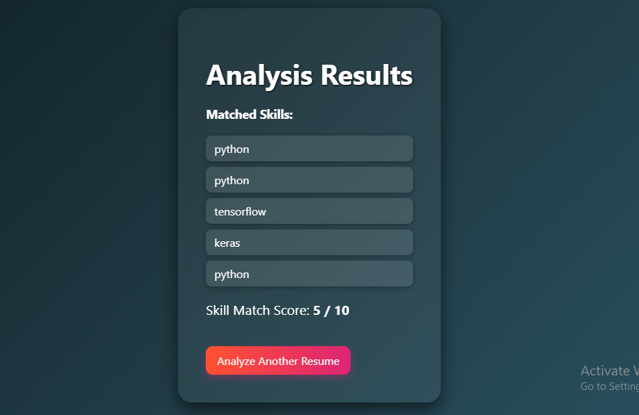
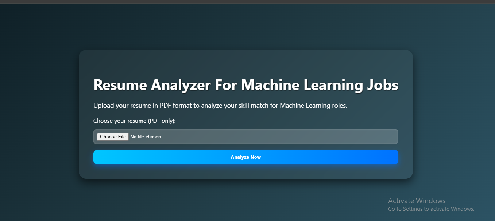

# 📝 Resume Analyzer App

A smart web application that analyzes PDF resumes and checks for the presence of key skills relevant to Machine Learning and Data Science roles. Built with **Flask**, this tool uses **Natural Language Processing (NLP)** techniques to tokenize resume content and match it against predefined industry-relevant keywords.

## 🚀 Live Demo

🌐 (https://resume-analyser-2hft.onrender.com)  

---
## 📸 Screenshots

| Upload Page | Results Page |
|-------------|--------------|
|  |  |


---

## 🔍 Features

- 📄 Upload resumes in **PDF format**
- 🧠 Extracts and tokenizes text using **NLTK**
- ✅ Matches resume content with important ML/AI keywords
- 📊 Displays skill match score and highlights matched skills
- 🎨 Stylish 3D UI with modern **glassmorphism** effect
- 🌐 Deploy-ready on platforms like **Render**, **Heroku**, or **Vercel**

---

## 🧠 Keywords Checked

```text
python, data analysis, machine learning, deep learning,
artificial intelligence, nlp, keras, tensorflow, r, sql
```

## 💻 Tech Stack Used

- Frontend: HTML, CSS (3D Effects, Responsive Design)
- Backend: Python, Flask
- NLP: NLTK
- PDF Handling: PyPDF2

## 📂 Project Structure

```text
resume-analyzer/
├── app.py
├── requirements.txt
├── templates/
│   ├── index.html
│   └── result.html
├── static/
│   └── style.css
├── README.md
```

## ⚙️ Setup Instructions

🔧 Local Setup
- Clone the repo
``` bash
git clone https://github.com/sandipanrakshit34/Resume-Analyzer-App.git
cd Resume-Analyzer-App
```
- Install dependencies
```bash
pip install -r requirements.txt

```

- Run the app
```bash
python app.py
```
- Open in browser
```bash
http://localhost:5000
```

## ☁️ Deployment (Render)
- Push code to GitHub
- Go to Render : https://render.com/
- Create a new Web Service → Connect GitHub repo
- Set:
    - Build Command: pip install -r requirements.txt
    - Start Command: python app.py
- Make sure app.py uses: 
```bash
app.run(host='0.0.0.0', port=int(os.environ.get("PORT", 5000)))
```

